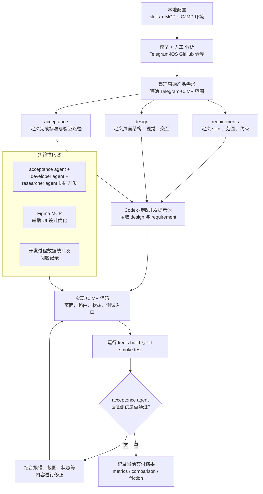
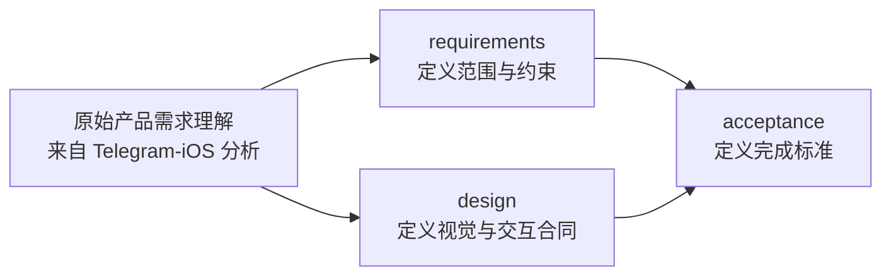

# CJMP AI 辅助开发流程说明

## 1. 开发总流程图



## 2. 配置本地 AI 开发环境

### 2.1. MCP 与 Skill 总览

| 类型 | 名称 | 主要功能 |
| --- | --- | --- |
| MCP | `cangjie-docs` | 查询仓颉语法、标准库和相关官方文档 |
| MCP | `context7` | 对应仓库中查询仓颉语言文档以及 CJMP 框架文档 |
| Skill | `cangjie-docs-navigator` | 约束模型优先通过文档检索流程处理仓颉问题 |
| Skill | `cjmp-env-setup` | 按固定流程检查并配置 CJMP 开发环境 |

### 2.2 `AGENTS.md` 配置


`AGENTS.md` 用于约束 AI 在当前 CJMP 项目中的默认行为。

####  配置步骤

该文件通常由 `keels create` 在工程初始化时生成，并由 CJMP SDK 拷贝至项目根目录。

#### 内容


### 2.3. `cangjie-docs` MCP 配置

#### 2.3.1 用途

用于查询仓颉语法、标准库及相关文档，也是 `cangjie-docs-navigator` skill 的依赖。

#### 2.3.2 配置前准备

预先下载 [`cangjie-docs-mcp` 可执行文件](https://github.com/ystyle/cangjie-docs-mcp/releases)，并记录其绝对路径。


#### 2.3.3 配置步骤

在 IDE 的 MCP 配置中写入或合并下面这段内容：

```json
{
  "mcpServers": {
    "cangjie-docs": {
      "command": "/你的实际路径/cangjie-docs-mcp",
      "args": [],
      "env": {},
    }
  }
}
```

执行步骤：

1. 打开 IDE 的 MCP 配置入口。
2. 找到或新建 `mcpServers` 节点。
3. 将 `cangjie-docs` 配置复制进去。
4. 把 `command` 改成真实绝对路径。
5. 保存配置。
6. 重启 IDE，或执行 Reload / Refresh MCP。

如果 IDE 已存在其他 MCP 配置，只需合并该服务，避免覆盖原有配置。

#### 2.3.4 验证方式

```text
使用 cangjie-docs MCP 查询仓颉 String.split 的文档，不要凭记忆回答。
```

### 2.4 `context7` MCP 配置

#### 2.4.1 用途

用于查询第三方框架文档，也可结合 `AGENTS.md` 检索 `hypheng/cjmp-ai-docs` 中的 CJMP 文档。

#### 2.4.2 配置前准备

在 [Context7 官网](https://context7.com/) 注册账号，并准备 `Context7 API Key`。

#### 2.4.3 配置步骤

在 IDE 的 MCP 配置中写入或合并下面这段内容：

```json
{
  "mcpServers": {
    "context7": {
      "command": "npx",
      "args": [
        "-y",
        "@upstash/context7-mcp",
        "--api-key",
        "你的实际 API Key"
      ],
      "env": {}
    }
  }
}
```

执行步骤：

1. 打开 IDE 的 MCP 配置入口。
2. 找到或新建 `mcpServers` 节点。
3. 将 `context7` 配置复制进去。
4. 把 API Key 替换成真实值。
5. 确认 `disabled` 为 `false`。
6. 保存配置。
7. 重启 IDE，或执行 Reload / Refresh MCP。

如果 IDE 已存在其他 MCP 配置，只需合并该服务，避免覆盖原有配置。

#### 2.4.4 如何使用

在提示词中明确说明“使用 context7 查询某个库或仓库文档”即可。

### 2.5 `cangjie-docs-navigator` Skill 配置

#### 2.5.1 用途

该 skill 约束模型优先按照文档检索流程处理仓颉问题，而非直接基于记忆作答。

#### 2.5.2 使用前提

前提条件是已完成 `cangjie-docs` MCP 配置。

#### 2.5.3 安装步骤

1. 定位当前 IDE 的 skills 目录。
2. 将整个 `skills/cangjie-docs-navigator/` 文件夹复制过去。
3. 确认复制的是完整文件夹，不是单独的 `SKILL.md`。
4. 重启 IDE，或刷新 skills 列表。

示例：

```bash
cp -r $CJMP_SDK_HOME/vibe-coding/skills/cangjie-docs-navigator "<Skills 目录>/cangjie-docs-navigator"
```

### 2.6 `cjmp-env-setup` Skill 配置

#### 2.6.1 用途

该 skill 用于指导模型按照固定流程检查和配置 CJMP 开发环境。

该 skill 通过 `keels doctor -v` 对当前环境进行确定性检查。根据 CJMP 命令行工具文档，`doctor` 用于检查当前环境配置，`-v` 用于输出完整检查项。
本机需已具备 Python、JDK 17，以及 Android Studio、DevEco Studio；在 macOS 环境下还需配置 Xcode。

#### 2.6.2 安装步骤

1. 定位当前 IDE 的 skills 目录。以 Trae 为例，skills 目录位于当前项目根目录下的 `.trae/skills`。
2. 将整个 `cjmp-env-setup/` 文件夹复制过去。
3. 重启 IDE，或刷新 skills 列表。

示例：

```bash
cp -r $CJMP_SDK_HOME/vibe-coding/skills/cjmp-env-setup "<Skills 目录>/cjmp-env-setup"
```

#### 2.6.3 验证方式

```text
给模型输入：请根据 README 中的指令，按步骤配置 CJMP SDK，并输出安装报告。
```
---


## 3. 模型 + 人工 分析原始需求

本项目的产品需求来自对 `Telegram-iOS` GitHub 仓库的模型辅助分析与人工抽象。由于 Telegram 的原始产品范围较大，因此未采用全量复刻，而是通过两步抽象形成适合本项目的需求边界：

1. 先从 `Telegram-iOS` 中提炼“值得保留的核心商业化体验”
2. 再把这些体验缩成适合跨框架重复交付的 MVP

### 3.1 模型与人工的分工

模型侧职责：
- 快速扫描仓库结构
- 总结典型需求、功能以及用户流
- 提取高频页面和关键交互
- 帮助归纳核心能力

人工侧职责：
- 对模型扫描的结果进行判断，决定哪些能力应该进入需求
- 控制 scope，避免项目失控

因此，该步骤并非“AI 自动生成需求”，而是“模型辅助分析 + 人工裁剪与确认”。

### 3.2 需求分析后输出结果

该步骤形成的是**原始产品需求理解**，主要包括：

- 要模拟 Telegram 的哪些主流程
- 哪些页面是客户一眼能感知到像 Telegram 的
- 哪些功能保留对比价值
- 哪些功能应该明确排除

## 4. 将原始需求拆分为 requirements、design、acceptance

### 4.1 requirements

`requirements` 的职责是定义“每个阶段允许做什么、禁止做什么”，重点回答以下问题：

- 当前需求的目标是什么
- 哪些功能在 scope 内，哪些不在
- 每个 slice 的边界是什么
- 每个 slice 的 `Must Not Be Implemented Yet` 是什么


### 4.2 design

`design` 的职责是定义“产品应当呈现何种形态，以及应采用何种交互方式”，重点回答以下问题：

- 页面结构是什么
- screen inventory 有哪些
- 登录、聊天列表、详情页的层次和视觉重点是什么
- 当前 slice 应该呈现哪些视觉和交互状态

因此，`design` 更接近“框架无关的 UI / 交互合同”。

### 4.3 acceptance

`acceptance` 的职责是定义“达到何种标准才可视为完成”，重点回答以下问题：

- slice pass criteria 是什么
- 要验证哪些用户路径
- 验证通过的标准是什么

因此，`acceptance` 更接近“完成定义与验收脚本”。

### 4.4 三者关系



如果不拆开，会产生几个问题：

- 需求和视觉描述混在一起，AI 容易误读
- 验收标准不清晰，容易导致 AI 无法精确实现用户需求
- slice 边界不稳定，AI 很容易把后续功能提前实现，打乱开发计划

step1 例子：
```
requirements：
允许有登录页、启动失败页、最小认证占位页
不允许提前做 demo verification、session restore、真实 home shell、chat list
登录页应当是极简 Telegram 风格，包含 Country / Region、Phone number、Keep me signed in on this device 等基础元素
这就是一个标准的 requirement 例子，因为它在管“范围”和“边界”。

design：
Telegram 纸飞机图标和 Telegram 字标居中
背景是 soft gray-white
输入框是 clean white surface
两个输入框分开，左对齐显示 China 和 +86
Keep me signed in on this device 放在输入框下方
这就是 design 的典型作用，它不再强调“能不能做”，而是在定义“怎么呈现”。

acceptance：
首次启动要干净地进入 login
startup failure 不能卡在 spinner
登录页必须清楚展示 Telegram 标识、国家和手机号输入框、可交互的 keep-signed-in 控件
页面不能看起来像开发占位页，并通过 smoke test
```
请先阅读 telegram-commercial-mvp 的 requirement / design / acceptance，并结合/Users/dzy/Desktop/project/TelegramAIDev-workflow/apps/cjmp/assets/telegram-commercial-cjmp 中的UI设计要求，实现当前 slice2 的相关内容，完成后使用 [$cjmp-ui-test](/Users/dzy/Desktop/project/TelegramAIDev-workflow/.agents/skills/cjmp-ui-test/SKILL.md)  做 smoke 自测。
## 5. 实际开发阶段

### 5.1 典型提示词

例如：

```text
请先阅读 telegram-commercial-mvp 的 requirement / design / acceptance，
实现当前 slice1 的相关内容，
完成后使用 $cjmp-ui-test 做 smoke 自测。
```

### 5.2 skills 和 MCP 在实际开发中的作用

| 场景 | 使用什么 | 作用 |
| --- | --- | --- |
| 查仓颉 / `CJMP`/`cangjie` 语法和 API | Context7 + `cangjie-docs` | 做文档型确认 |
| 跑 `CJMP` iOS smoke 自测 | `$cjmp-ui-test` | 做 app 内断言 + XCTest 驱动 + 截图导出 |
| 记录交付成本 | `$delivery-run-metrics` skills | 实验性skills，记录 duration / step / token |
| 记录 AI 交付摩擦 | `$ai-efficiency-friction-check` skills | 实验性skills，输出 repo 级问题资产 |


delivery-run-metrics结果如下，该skills从codex的日志文件进行数据读取和分析，实测时间统计结果和codex页面输出接近，但codex本身页面只显示上下文余量，所以token消耗无法人工核对

```json
{
  "codex_session_file": "/Users/.codex/sessions/2026/04/07/rollout-2026-04-07T14-51-58-019d66b6-5490-7ac3-9fab-e26cd9f807aa.jsonl",
  "codex_thread_id": "019d66b6-5490-7ac3-9fab-e26cd9f807aa",
  "ended_at": "2026-04-07T08:03:17Z",
  "framework_lane": "cjmp",
  "round_id": "20260407T065347Z-cjmp-requirement-c58f65a7",
  "started_at": "2026-04-07T06:53:47Z",
  "steps": [
    {
      "duration_sec": 193,
      "ended_at": "2026-04-07T06:58:01Z",
      "name": "discovery",
      "started_at": "2026-04-07T06:54:48Z"
    },
    {
      "duration_sec": 1120,
      "ended_at": "2026-04-07T07:16:55Z",
      "name": "scaffold",
      "started_at": "2026-04-07T06:58:15Z"
    },
    {
      "duration_sec": 2245,
      "ended_at": "2026-04-07T07:54:47Z",
      "name": "implementation",
      "started_at": "2026-04-07T07:17:22Z"
    },
    {
      "duration_sec": 186,
      "ended_at": "2026-04-07T07:58:38Z",
      "name": "validation",
      "started_at": "2026-04-07T07:55:32Z"
    }
  ],
  "token_consumption": {
    "cached_input_tokens": 31893632,
    "input_tokens": 33793692,
    "output_tokens": 72508,
    "reasoning_output_tokens": 38245,
    "total_tokens": 33866200
  },
  "token_usage_delta": {
    "cached_input_tokens": 31893632,
    "input_tokens": 33793692,
    "output_tokens": 72508,
    "reasoning_output_tokens": 38245,
    "total_tokens": 33866200
  },
  "token_usage_end": {
    "last": {
      "cached_input_tokens": 461696,
      "input_tokens": 463072,
      "output_tokens": 112,
      "reasoning_output_tokens": 20,
      "total_tokens": 463184
    },
    "model_context_window": 950000,
    "timestamp": "2026-04-07T08:03:08.791Z",
    "total": {
      "cached_input_tokens": 31948672,
      "input_tokens": 33869104,
      "output_tokens": 74509,
      "reasoning_output_tokens": 39093,
      "total_tokens": 33943613
    }
  },
  "token_usage_source": "codex-session-jsonl",
  "token_usage_start": {
    "last": {
      "cached_input_tokens": 26240,
      "input_tokens": 26945,
      "output_tokens": 741,
      "reasoning_output_tokens": 275,
      "total_tokens": 27686
    },
    "model_context_window": 950000,
    "timestamp": "2026-04-07T06:53:35.882Z",
    "total": {
      "cached_input_tokens": 55040,
      "input_tokens": 75412,
      "output_tokens": 2001,
      "reasoning_output_tokens": 848,
      "total_tokens": 77413
    }
  },
  "total_duration_sec": 4170,
  "version": 1,
  "work_item_ref": "telegram-commercial-mvp-slice1",
  "work_item_type": "requirement",
  "working_effort_summary": "created apps/cjmp slice1 bootstrap/login shell/placeholder and CJMP iOS smoke stack; iOS app build succeeded; smoke reached the in-app smoke page once but ended with Smoke suite failed, and a later rerun became unstable with unexpected exit"
}

```

ai-efficiency-friction-check 输出结果如下，主要是AI输出过程中遇到的问题记录在此，可以作为优化的方向：
```
# CJMP iOS Smoke Harness Stability Gap

## Summary

The current CJMP iOS delivery path for UI smoke validation is workable only after manual repair, and even then the final acceptance evidence remains unstable.

## Confirmed Friction In This Round

- `keels create` generated an iOS project that did not include the `ohos.ui_test` search paths required by the app-side smoke suite.
- the generated `cjmp.xcodeproj` did not link and embed the runtime frameworks under `ios/frameworks/`, so `xcodebuild build-for-testing` initially failed before UI testing could start.
- once the build path was repaired, XCTest still could not reliably discover CJMP UI elements by visible text or semantic accessibility, so the outer shell had to fall back to normalized coordinates.
- even with the repaired stack, the best real-device run finished in an app-side `Smoke suite failed` terminal state, and a later rerun became unstable enough to exit before a stable terminal state was exposed again.

## Evidence

- app-side build originally failed with `can not find the following dependencies: ohos.ui_test`.
- `xcodebuild build` originally failed with unresolved `StageApplication` / `StageViewController` symbols until the framework link/embed phase was repaired.
- real-device XCTest was executed on `Cen的iPhone` (`00008140-000408510A02801C`).
- repaired real-device run with the strongest evidence:
  - xcresult: `/tmp/cjmp-ui-test-20260407T074848Z.xcresult`
  - exported attachments: `/tmp/xcresult-attachments-20260407T075025Z`
  - durable screenshots copied into the repo:
    - `reports/comparison/artifacts/cjmp-slice1/launch-login-shell.png`
    - `reports/comparison/artifacts/cjmp-slice1/smoke-terminal-failed.png`
  - the terminal screenshot shows the implementation-local smoke page with explicit status text `Smoke suite failed`
- later rerun with weaker acceptance quality:
  - xcresult: `/tmp/cjmp-ui-test-20260407T075531Z.xcresult`
  - the run restarted after an unexpected app exit before a stable terminal status was captured again

## Delivery Impact

- AI could not rely on the template project alone to reach smoke validation.
- acceptance time increased because project linking, framework embedding, and XCTest driving all needed manual repair.
- final validation quality is still weaker than desired because the smoke pass/fail/crash state is only reliably available by screenshot inspection, not by stable XCTest semantics.

## Workaround Used In This Round

- manually restored `CJMP_TEST_PATH` and `ohos.ui_test` dependency paths in `build.sh` and `lib/cjpm.toml`
- reused and repaired the existing iOS XCTest target / shared scheme
- programmatically added the missing iOS runtime framework link/embed entries
- iterated on XCTest coordinate taps with exported screenshots and UI hierarchy dumps

## Follow-up Recommendation

- fix the CJMP app template so it emits a smoke-ready iOS project by default:
  - include `ohos.ui_test` dependency paths
  - include runtime framework link/embed phases
  - include a ready XCTest shell target wired to the main app scheme
- improve CJMP iOS accessibility exposure so XCTest can target semantic ids or labels instead of normalized coordinates and screenshot-only review
- add a deterministic smoke terminal surface that remains visible after the embedded `ohos.ui_test` suite finishes and make that terminal text discoverable to XCTest

```

### 5.3 UI smoke test

`$cjmp-ui-test` 用于为 `CJMP` UI 交付提供标准化的 smoke 验证能力。

其主要作用包括：

- 在 iOS 端对当前 UI 变更执行一轮 smoke 验证
- 对关键页面与关键流程的连通性进行快速校验
- 输出截图与状态结果，作为本轮 UI 变更的验证证据

### 5.4 人工检查

每当一个requirements完成后，可根据AI输出的报告进行检查，观察功能是否有遗漏或者缺失

## 6. 下一步规划

#### 6.1 接入逻辑测试框架
UI 内容开发完成后，为实现Telegram完整后端逻辑，需引入逻辑测试框架，使得AI完成逻辑功能后，具有自闭环能力

#### 6.2 实现具有后端能力的完整 CJMP 工程
实现Telegram-CJMP完整能力，且路径可复制，能力可迁移，用于推广 CJMP 框架及 ai 辅助编程能力

#### 6.3 AI 能力提升
- 多agent编排开发方式路径可探索，多agent在任务分离度较高场景下可明显提高AI生成代码的效率
- context7 能力转移至蓝区服务器，可自行维护仓颉 / CJMP 语法文档
- skills、mcp工具交付，如 ui-test skills、logic-test skills 等
